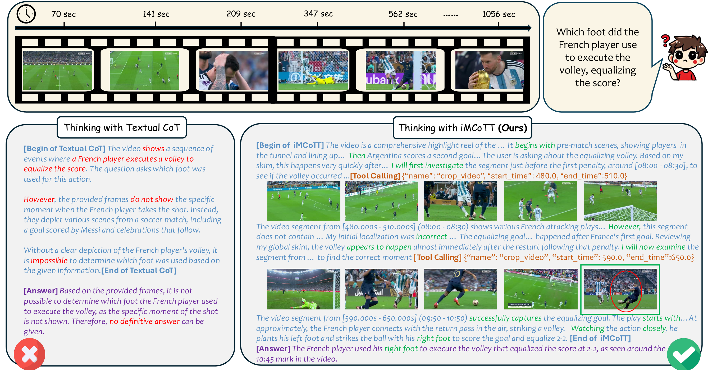

# LongVT: Incentivizing "Thinking with Long Videos" via Native Tool Calling
<div align="center">
  
</div>

<br>

<div align="center">

[](https://arxiv.org/abs/2511.16334)
[](https://evolvinglmms-lab.github.io/LongVT/)
[](https://github.com/EvolvingLMMs-Lab/LongVT)
[](https://huggingface.co/datasets/longvideotool/LongVT-Parquet)
[](https://huggingface.co/collections/lmms-lab/longvt)
[](https://huggingface.co/spaces/longvideotool/LongVT-Demo)
[](https://www.lmms-lab.com/posts/longvt/)
</div>

## 🎉 News
- **[2025-11]**: We have created a fun cartoon ([Conan_EN](assets/longvt_cartoon_en.pdf)|[Conan_CN](assets/longvt_cartoon_cn.pdf)) to explain LongVT. Enjoy :) Credit to the amazing [NotebookLM](https://notebooklm.google.com/) and [Gemini-3](https://blog.google/products/gemini/gemini-3/#learn-anything).
- **[2025-11]**: Join our WeChat group by scanning this [QR code](assets/qr_code.jpg).
- **[2025-11]**: We release all of our codes, data, and model checkpoints! Check out the [LongVT collection on Hugging Face](https://huggingface.co/collections/lmms-lab/longvt).

## Table of Contents

- [Overview](#overview)
- [Installation](#installation)
  - [SFT Training](#1-sft-training)
  - [RL Training](#2-rl-training)
  - [RFT Training](#3-rft-training)
  - [Evaluation](#4-evaluation)
  - [Data Pipeline](#5-data-pipeline)
- [Getting Started](#getting-started)
  - [Data Preparation](#data-preparation)
  - [SFT Training](#sft-training)
  - [RL Training](#rl-training)
  - [RFT Training](#rft-training)
  - [Evaluation](#evaluation)
  - [LLM Judge Setup](#llm-judge-setup)
  - [Data Pipeline](#data-pipeline)
- [Evaluation Results](#evaluation-results)
- [Citation](#citation)
- [Acknowledgements](#acknowledgements)
- [Star History](#star-history)

## Overview

<div align="center">
  
</div>

Large multimodal models (LMMs) have shown great potential for video reasoning with textual Chain-of-Thought. However, they remain vulnerable to hallucinations, especially when processing long-form videos where evidence is sparse and temporally dispersed.

Inspired by how humans comprehend long videos—by first skimming globally and then examining relevant clips for details—we introduce **LongVT**, an end-to-end agentic framework that enables "Thinking with **Long V**ideos" via interleaved Multimodal Chain-of-**T**ool-Thought.
Specifically, we exploit LMMs' inherent temporal grounding ability as a native video cropping tool to zoom in on a specific video clip and resample finer-grained video frames. This global-to-local reasoning loop continues until answers are grounded in retrieved visual evidence. Given the scarcity of fine-grained question-answering (QA) data for the long video reasoning task, we curate and will release a data suite named **VideoSIAH** to facilitate both training and evaluation. Specifically, our training dataset consists of 247.9K samples for tool-integrated cold-start supervised fine-tuning, 1.6K samples for agentic reinforcement learning, and 15.4K samples for agentic reinforcement fine-tuning, respectively. Our evaluation benchmark consists of 1,280 QA pairs that are carefully curated through a semi-automatic data pipeline with human-in-the-loop validation. With a meticulously designed three-stage training strategy and extensive empirical validation, LongVT consistently outperforms existing strong baselines across four challenging long-video understanding and reasoning benchmarks.


## Installation

### 1. SFT Training

Please follow the installation instructions in [lmms-engine](https://github.com/EvolvingLMMs-Lab/lmms-engine) to prepare the environment for supervised fine-tuning.

### 2. RL Training

We provide our source implementation of `verl`, which is a detached fork from the original [verl](https://github.com/volcengine/verl) repository. You may choose to use either our integrated version or the original `verl` library for RL training. However, for seamless reproduction, we highly recommend using our provided environment.

First, clone the repository and create a dedicated Conda environment:

```bash
git clone https://github.com/EvolvingLMMs-Lab/LongVT.git
cd LongVT

conda create -n longvt python=3.10
conda activate longvt
```

Next, install the RL training pipeline and dependencies:

```bash
# Install dependencies
USE_MEGATRON=0 bash scripts/install_vllm_sglang_mcore.sh

# Install the package in editable mode without extra dependencies
pip install --no-deps -e .
```
Note: If you encounter any issues during execution, please refer to requirement_reproduce.txt to verify your dependency versions.

We also include a verl_0.6 branch in this repository. For environment installation regarding this branch, please refer to the official verl v0.6 documentation. However, please note that we strictly recommend using the main branch (as detailed above) for reliable reproduction, as the 0.6 branch may have consistency issues.

We recommend you to use separate environments if you encounter a conflict in requirements.

### 3. RFT Training

RFT (Reinforcement Fine-Tuning) shares the same environment as SFT training. Please follow the [SFT Training](#1-sft-training) installation instructions.

### 4. Evaluation

Please follow the installation instructions in [lmms-eval](https://github.com/EvolvingLMMs-Lab/lmms-eval) to set up the evaluation environment.

### 5. Data Pipeline

We open-sourced our data processing pipeline and code for the community to follow. The pipeline includes video scene detection, video captioning, and event merging functionalities.

To install the dependencies for data pipeline:

```bash
cd ./data

# Option 1: Using uv (recommended)
uv pip install -e .

# Option 2: Using pip
pip install -e .

# Optional: Install development dependencies for code formatting
uv pip install -e ".[dev]"
```

**Key Dependencies:**
- `decord`: Video frame extraction
- `scenedetect`: Scene boundary detection
- `qwen-vl-utils`: Qwen VL utilities for video processing
- `openai`: OpenAI-compatible API client for LLM services

We recommend using a separate environment if you encounter conflicts with other packages.

## Getting Started

### Data Preparation

We provide our training data annotations on Hugging Face. You can download them using the following commands:

```bash
# Install huggingface_hub if not already installed
pip install huggingface_hub

# Download all annotation files
huggingface-cli download longvideotool/LongVT-Parquet --repo-type dataset --local-dir ./data
```

The dataset includes:
- **SFT Data**: ~248K samples for cold-start supervised fine-tuning
- **RL Data**: ~1.6K samples for agentic reinforcement learning  
- **RFT Data**: ~15K samples for agentic reinforcement fine-tuning

**Source Videos:** We are currently working on uploading the source video files to Hugging Face. Due to the large file sizes, this process may take some time. Please stay tuned for updates on our [Hugging Face collection](https://huggingface.co/collections/lmms-lab/longvt).

### SFT Training

After installing [lmms-engine](https://github.com/EvolvingLMMs-Lab/lmms-engine), you can launch SFT training using either:

**Option 1: Using a configuration YAML file**

```bash
# Edit the dataset paths in longvt_7b_sft.yaml
torchrun --nproc_per_node="8" \
    --nnodes="1" \
    --node_rank="0" \
    --master_addr="127.0.0.1" \
    --master_port="8000" \
    -m lmms_engine.launch.cli config_yaml=./examples/sft/longvt_7b_sft.yaml
```

**Option 2: Using the launch script**

```bash
# Edit the dataset paths and hyperparameters in the script
bash examples/sft/run_longvt_7b_sft.sh
```

**Troubleshooting:**
- If you encounter **OOM (Out of Memory)** errors, reduce the `packing_length` parameter in your configuration.

### RL Training

**Training with Ray**

To perform training in a multi-node environment, you first need to set up a Ray cluster on your head and worker nodes. While there are various ways to launch Ray, we provide a reference script to help you get started:

```bash
bash examples/video_tools/launch.sh
```
Once the Ray cluster is active, you can submit the training job using the following script:

```bash
bash examples/video_tools/longvt_7b_rl_train.sh
```

Note: Please remember to update the corresponding variables in the scripts to match your environment before running them.

### RFT Training

RFT (Reinforcement Fine-Tuning) training follows the same procedure as SFT training. Simply use the RFT configuration and scripts:

```bash
# Edit the dataset paths in longvt_7b_rft.yaml
bash examples/rft/run_longvt_7b_rft.sh
```

### Evaluation

We provide evaluation scripts and task configurations in `lmms_eval_tasks/`. Three task types are supported with different prompting strategies:

| Task Type | Description | Example Tasks |
|-----------|-------------|---------------|
| **Non-Think** | Direct answer without reasoning (for baseline models like Qwen2.5-VL) | `videomme_w_subtitle`, `video_mmmu`, `lvbench`, `longvt_non_think` |
| **Think** | With CoT reasoning process (for reasoning models like Video-R1) | `videomme_w_subtitle_reward`, `video_mmmu_reasoning`, `lvbench_reasoning`, `longvt_reasoning` |
| **Tool** | With native tool calling enabled (for agentic models like LongVT) | `videomme_w_subtitle_reward_tool`, `video_mmmu_reasoning_tool`, `lvbench_tool`, `longvt` |

To run evaluation:

```bash
# For baseline models with direct answering
bash examples/eval/run_eval.sh /path/to/checkpoint longvt_non_think False 512

# For reasoning models without tool calling
bash examples/eval/run_eval.sh /path/to/checkpoint longvt_reasoning False 512

# For reasoning models with native tool calling
bash examples/eval/run_eval.sh /path/to/checkpoint longvt False 512
```

**Arguments:**
- `$1`: Path to model checkpoint
- `$2`: Task name (see table above)
- `$3`: Whether using Qwen3-VL model (`True`/`False`)
- `$4`: Maximum number of frames (default: 768)

### LLM Judge Setup

We use an LLM-based judge both for evaluation and for computing RL rewards.  
By default, we use `Qwen/Qwen2.5-72B-Instruct` as the judge model.

**Steps:**
1. Start a judge server with vLLM or SGLang

```bash
# Example with vLLM
vllm serve Qwen/Qwen2.5-72B-Instruct \
    --port 1234 \
    --gpu-memory-utilization 0.8 \
    --max-model-len 131072 \
    --tensor-parallel-size 8 \
    --served-model-name "judge" \
    --trust-remote-code
```

```bash
# Example with SGLang
python3 -m sglang.launch_server --model-path Qwen/Qwen2.5-72B-Instruct \
    --tp-size 8 \
    --dp-size 1 \
    --served-model-name judge \
    --port 1234 \
    --host 0.0.0.0 \
    --mem-fraction-static 0.75
```

2. Configure the judge endpoint in your scripts:
   Set the judge service base URL in longvt_7b_rl_train.sh via the LLM_AS_A_JUDGE_BASE environment variable.

### Data Pipeline

To follow our data curation pipeline, we provide example scripts in `data/scripts`. The pipeline supports the following operations:

#### 1. Scene Detection

Detect scene boundaries in long videos:

```bash
cd data

python launch/scene_detect.py \
    --input_file /path/to/video_list.txt \
    --output_path detect_results.json \
    --num_parts 10
```

The `video_list.txt` should contain one video path per line.

#### 2. Video Captioning

Generate captions for each detected scene using an LLM service:

```bash
export OPENAI_BASE_URL="http://your-vlm-server:8000/v1"
export OPENAI_API_KEY="your-api-key"

python launch/caption.py \
    --input_path detect_results.json \
    --output_path caption_results.json \
    --server openai \
    --fps 4
```

## Evaluation Results

Our **LongVT-7B** model demonstrates strong performance across various long video understanding and reasoning benchmarks. Notably, LongVT-7B-RFT achieves **47.7%** average score with dense frame sampling, and **42.0%** on our proposed VideoSIAH-Eval benchmark (best among all open-source models), demonstrating the effectiveness of our tool-augmented reasoning approach for long video understanding.

| Model | Reasoning<br/>Prompt | Tool<br/>Calling | VideoMME<br/>(≈1018 sec) | VideoMMMU<br/>adapt. | VideoMMMU<br/>comp. | VideoMMMU<br/>perc. | LVBench<br/>(≈4101 sec) | VideoSIAH-Eval<br/>(≈1688 sec) | Average<br/>Score |
|-------|:---:|:---:|:---:|:---:|:---:|:---:|:---:|:---:|:---:|
| **Proprietary LMMs** |||||||||
| GPT-4o | ✗ | ✗ | 77.2† | 66.0† | 62.0† | 55.7† | 30.8† | 17.4 | 51.5 |
| Gemini 1.5 Pro | ✗ | ✗ | 81.3† | 59.0† | 53.3† | 49.3† | 33.1† | - | 55.2 |
| **Open-Source LMMs (Sparse Sampling)** |||||||||
| Qwen2.5-VL-7B | ✗ | ✗ | 62.6 | 37.3 | 28.0 | 36.7 | 30.7 | 28.1 | 37.2 |
| Video-R1-7B | ✓ | ✗ | 61.0 | 36.3 | 40.7 | 52.3 | 37.2 | 27.9 | 42.6 |
| VideoRFT-7B | ✓ | ✗ | 60.9 | 36.7 | 42.0 | 53.0 | 34.7 | 26.5 | 42.3 |
| Video-Thinker-7B | ✓ | ✗ | 61.0 | 34.3 | 44.7 | 53.0 | **52.2** | 10.4 | 42.6 |
| LongVT-7B-SFT (Ours) | ✓ | ✓ | 12.5 | **37.7** | **46.0** | **58.3** | 36.0 | 26.8 | 36.2 |
| **LongVT-7B-RL (Ours)** | ✓ | ✓ | **66.1** | 32.7 | 44.7 | 50.0 | 37.8 | **31.0** | **43.7** |
| **Open-Source LMMs (Dense Sampling)** |||||||||
| Qwen2.5-VL-7B | ✗ | ✗ | 64.3 | 35.7 | **44.3** | **56.7** | 40.9 | 33.8 | 46.0 |
| Video-R1-7B | ✓ | ✗ | 60.5 | 37.3 | 38.7 | 46.3 | 40.1 | 33.1 | 42.7 |
| VideoRFT-7B | ✓ | ✗ | 49.2 | **37.7** | 40.7 | 48.7 | 18.7 | 26.9 | 37.0 |
| Video-Thinker-7B | ✓ | ✗ | 60.8 | **37.7** | 42.7 | 55.3 | **54.3** | 6.6 | 42.9 |
| LongVT-7B-SFT (Ours) | ✓ | ✓ | 64.9 | 32.3 | 42.0 | 49.7 | 41.1 | 34.8 | 44.1 |
| LongVT-7B-RL (Ours) | ✓ | ✓ | 66.1 | **37.7** | 42.3 | 56.3 | 41.4 | 35.9 | 46.6 |
| **LongVT-7B-RFT (Ours)** | ✓ | ✓ | **67.0** | 35.7 | 43.7 | **56.7** | 41.3 | **42.0** | **47.7** |

**Note:** Bold numbers indicate the best performance among open-source models. † indicates results sourced from official reports. Numbers with "≈" denote the average video duration of each benchmark.

## Citation

If you find this project helpful, please consider citing our paper with:

```bibtex
@article{yang2025longvt,
    title={LongVT: Incentivizing "Thinking with Long Videos" via Native Tool Calling},
    author={Yang, Zuhao and Wang, Sudong and Zhang, Kaichen and Wu, Keming and Leng, Sicong and Zhang, Yifan and Qin, Chengwei and Lu, Shijian and Li, Xingxuan and Bing, Lidong},
    journal={arXiv preprint arXiv:2511.16334},
    year={2025}
}
```

## Acknowledgements

We gratefully acknowledge the following open-source projects that made this work possible:

- [**lmms-engine**](https://github.com/EvolvingLMMs-Lab/lmms-engine) for the SFT/RFT training infrastructure and tools.
- [**verl**](https://github.com/volcengine/verl) for the RL training framework.
- [**lmms-eval**](https://github.com/EvolvingLMMs-Lab/lmms-eval) for providing the comprehensive evaluation framework for large multimodal models.

We thank the developers and contributors of these projects for their excellent work and for making their code publicly available.

## ⭐ Star History

[](https://github.com/EvolvingLMMs-Lab/LongVT&Date)
